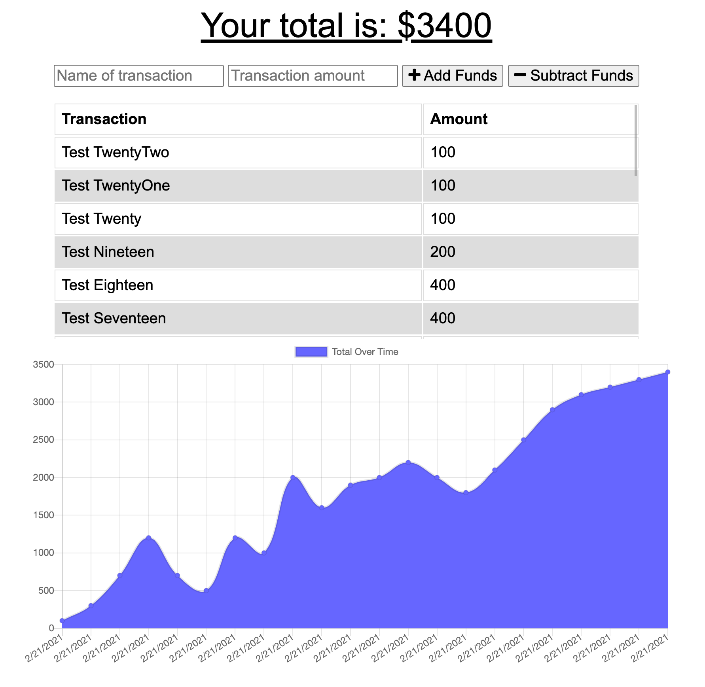

# Online/Offline Budget Tracker

## Description

Tracks withdrawals and deposits to assist the user in managing their budget. Previous transactions are used to display the current total, a list of transactions, and an integrated line chart.

[View Live Demo](https://jkg-budget-tracker.herokuapp.com/)

## Table of Contents

- [View](#view)
- [Installation](#installation)
- [Usage](#usage)
- [Questions](#questions)
- [License](#license)

## View

## Installation

Select the installation option from the browser menu bar or clicking the installation icon on the right-hand side of the browser address bar.

## Usage

As a progressive web application, this budget tracker continues to function if the user loses their internet connection. When offline, the application will still update to reflect any monetary transaction the user enters, and all transactions will be cached in client-side storage. The remote database will be updated with the cached transactions once the client is reconnected to the internet.

## Questions

Please feel free to contact via email if you have any questions pertaining to this project.  
Email: jkole822@gmail.com  
[GitHub Profile](https://github.com/jkole822)

## License

[MIT](https://choosealicense.com/licenses/mit)
